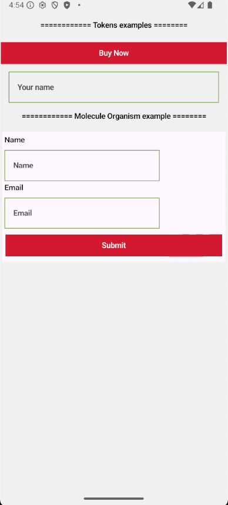

# ✨ Brand-Aware Jetpack Compose Design System
This project is a brand-agnostic design system built with Jetpack Compose, showcasing scalable architecture for multi-brand theming, token injection, and atomic design principles (Atoms, Molecules, Organisms).
Designed as a reference implementation for lead and architecture roles.

# 📦 Features
✅ Modular Jetpack Compose structure
✅ Token-driven theming using MaterialTheme
✅ Brand-specific overrides via Gradle product flavors
✅ Type-safe design tokens: colors, typography, spacing, shapes
✅ CompositionLocal-based spacing injection (LocalSpacing)
✅ Clean separation of atoms, molecules, and organisms
✅ Theme preview support via a playground module
🔜 Upcoming: Figma Variable API or JSON-based cloud token integration

# 🏗️ Project Structure
```text
designsystem/      # Brand-agnostic tokens + UI components
├── tokens/        # ColorPalette, TypographyPalette, ShapePalette, SpacingScale
├── atoms/         # Reusable UI primitives (AppButton, AppTextInput, etc.)
├── molecules/     # UI composites (LabeledTextInput, etc.)
├── organisms/     # UI blocks (ProfileCard, etc.)

app/               # Flavor-specific overrides
├── src/brandA/    # BrandA tokens + provider
├── src/brandB/    # BrandB tokens + provider
├── theme/         # AppTheme wrapper that injects tokens

playground/        # Preview + dev-only sandbox
```
## 📸 Screenshots

### 🔵 BrandA Theme


### 🔴 BrandB Theme


# 🚀 How It Works
Each brand implements a BrandTokenProvider that provides:

colors(): ColorScheme

typography(): Typography

shapes(): Shapes

spacing(): SpacingScale

This gets injected via AppTheme, allowing all components to access design tokens through MaterialTheme and LocalSpacing.

# 📱 Previewing Components
To test components visually:

Use the playground module

Swap in different token sets via preview composables

No need to switch flavors to test UI layouts

# 🔮 Future Enhancements
Figma Variables API integration (via REST)

JSON token ingestion at build time via Gradle task

KMP readiness for iOS token sharing

Snapshot testing with Paparazzi or Screenshot Tests

# 📂 Clone & Run
```text
git clone https://github.com/your-username/design-system-compose.git
cd design-system-compose
./gradlew :app:assembleBrandADebug
```